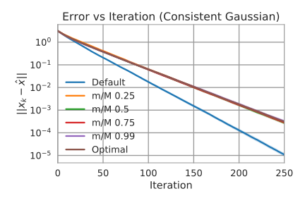
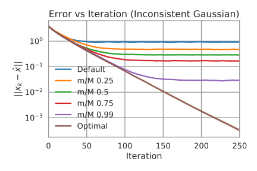
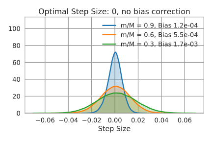
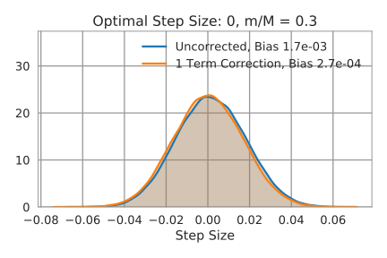

## Approximately Optimally
## Relaxed Randomized Kaczmarz

&nbsp;

Jacob

-vertical-

Here there be MathJax

\\(
\def\argmin#1{\underset{#1}{\arg\min}}
\def\norm#1{\lVert#1\rVert}
\def\R{\mathbb{R}}
\def\P{\mathbf{P}}
\def\E{\mathbb{E}}
\def\e{\mathbf{e}}
\def\x{\mathbf{x}}
\def\y{\mathbf{y}}
\def\A{\mathbf{A}}
\def\b{\mathbf{b}}
\def\t{\intercal}
\def\xexact{\x^\ast}
\def\dd#1#2{\frac{\mathrm{d} #1}{\mathrm{d} #2}}
\def\innerprod#1#2{\langle #1 , #2 \rangle}
\\)

-horizontal-

## Problem

Seek the least-squares solution of \\(\A\x\approx\b\\)

\\[\xexact = \argmin{\x} \norm{\b-\A\x}^2 \\]

In the overdetermined inconsistent case

\\[A \in \R^{M \times N}, \; M \gt\gt N\\]
\\[ \norm{\b-\A\xexact}^2 \gt 0 \\]

-horizontal-

## Randomized Kaczmarz (RK)

1. Pick \\(i\\) with \\(\P(i=j) \propto \norm{\A\_j}^2\\)

1. Set \\(\x^{(k+1)} = \x^{(k)} + \frac{(b\_i-\A\_i \x^{(k)})}{\norm{\A\_i}^2}\A\_i^\t\\)

1. Repeat

-vertical-

## Convergence Horizon

\\[
\E \norm{\x^{(k)}-\xexact}^2 \le r^k \norm{\x^{(0)} - \xexact}^2 + \frac{\norm{\b-\A\xexact}^2}{\sigma\_{N}^2}
\\]

Where \\(r = 1-\frac{\sigma\_N^2}{\sum\_{l=1}^N \sigma\_l^2}\\)

-horizontal-

## Relaxed RK

Replace \\(\frac{(b\_i-\A\_i \x^{(k)})}{\norm{\A\_i}^2}\\) with \\(\gamma\_k\\)

\\[
\x^{(k+1)} = \x^{(k)} + \gamma\_k \A\_i^\t
\\]

-vertical-

## Optimal Step Size

Ideally, \\(\gamma\_k = \argmin{}\norm{\b-\A\x^{(k+1)}}^2\\)

-vertical-

\\[
\begin{align}
\mathbf 0 &=\dd{}{\gamma\_k}\norm{\b-\A\x^{(k+1)}}^2 \\\\
&=\dd{}{\gamma\_k}\norm{\b-\A(\x^{(k)} + \gamma\_k \A\_i^\t)}^2 \\\\
&= -2\A\_i\A^\t\left[\b-\A\left(\x^{(k)} + \gamma\_k \A\_i^\t\right)\right] \\\\
& \propto \gamma\_k \norm{\A\_i \A^\t}^2 - \A\_i \A^\t \left(\b-\A\x^{(k)}\right)
\end{align}
\\]

-vertical-

\\[
\begin{align}
\gamma\_k &= \frac{A\_i A^\t (\b-\A\x^{(k)})}{\norm{\A\_i \A^\t}^2} \\\\
\end{align}
\\]

-horizontal-

## Optimally Relaxed RK

1. Pick \\(i\\) with \\(\P(i=j) \propto \norm{\A\_j \A^\t}^2\\)

1. Set \\(\x^{(k+1)} = \x^{(k)} + \frac{\A\_i \A^\t (\b-\A\x^{(k)})}{\norm{\A\_i \A^\t}^2}\A\_i^\t\\)

1. Repeat

-vertical-

## Convergence

Define \\(\e^{(k)}=\x^{(k)} - \xexact\\)

\\[
\begin{align}
\e^{(k+1)} &= \e^{(k)} + \frac{A\_i A^\t (\b-\A\xexact - \A\e^{(k)})}{\norm{\A\_i \A^\t}^2}\A\_i^\t \\\\
&= \left[I - \frac{\A\_i^\t \A\_i \A^\t \A}{\norm{\A\_i \A^\t}^2}\right]\e^{(k)}
\end{align}
\\]

-vertical-

\\[
\A \e^{(k+1)} = \left[I - \frac{\A\A\_i^\t \A\_i \A^\t }{\norm{\A\_i \A^\t}^2}\right]\A\e^{(k)}
\\]

Borrowing the convergence of RK

\\[
\E \norm{\A\e^{(k)}}^2 \le \left(1 - \frac{\sigma\_N^4}{\sum\_{l=1}^N \sigma\_l^4}\right)^k \norm{\A\e^{(0)}}^2
\\]

-vertical-

\\[
\E \norm{\x^{(k)}-\xexact}^2 \le \frac{\sigma\_1^2}{\sigma\_N^2}r^k \norm{\x^{(0)} - \xexact}^2
\\]

Where \\(r = 1 - \frac{\sigma\_N^4}{\sum\_{l=1}^N \sigma\_l^4}\\)

-horizontal-

## Approximately
## Optimally Relaxed RK

Let \\(\tau\\) be a random set of indices and consider

\\[
\gamma\_k = \frac{\A\_i \A\_\tau^\t (\b\_\tau-\A\_\tau\x\_k)}{\norm{\A\_i \A\_\tau^\t}^2}
\\]

-vertical-

If \\(\tau = \\{i\\}\\) we recover the standard RK update:

\\[
\begin{align}
\gamma\_k &= \frac{A\_i A\_\tau^\t (\b\_\tau-\A\_\tau\x\_k)}{\norm{\A\_i \A\_\tau^\t}^2} \\\\
&= \frac{\A\_i \A\_i^\t (\b\_i-\A\_i\x\_k)}{\norm{\A\_i \A\_i^\t}^2} \\\\
&= \frac{\b\_i-\A\_i\x\_k}{\norm{\A\_i}^2}
\end{align}
\\]

-vertical-

While if \\(\tau = \\{1, 2, \dots, M\\}\\)

\\[
\begin{align}
\gamma\_k &= \frac{A\_i A\_\tau^\t (\b\_\tau-\A\_\tau\x\_k)}{\norm{\A\_i \A\_\tau^\t}^2} \\\\
&= \frac{\A\_i \A^\t (\b-\A\x\_k)}{\norm{\A\_i \A^\t}^2}
\end{align}
\\]

we recover the optimally relaxed RK update

-vertical-

## Future Work

Prove convergence results for approximate method

-vertical-

## Convergence (Consistent)

Define \\(\e^{(k)}=\x^{(k)} - \xexact\\)

\\[
\e^{(k+1)} = \left[I - \frac{\A\_i^\t \A\_i \A\_\tau^\t \A\_\tau}{\norm{\A\_i \A\_\tau^\t}^2}\right]\e^{(k)}
\\]

\\[
\A\_\tau \e^{(k+1)} = \left[I - \frac{\A\_\tau \A\_i^\t \A\_i \A\_\tau^\t}{\norm{\A\_i \A\_\tau^\t}^2}\right]\A\_\tau \e^{(k)}
\\]

-vertical-

\\[
\begin{align}
\norm{\A\_\tau \e^{(k+1)}}^2 &= \norm{\A\_\tau \e^{(k)}}^2 - \norm{\frac{\A\_\tau \A\_i^\t \A\_i \A\_\tau^\t}{\norm{\A\_i \A\_\tau^\t}^2}\A\_\tau \e^{(k)}}^2 \\\\
&= \norm{\A\_\tau \e^{(k)}}^2 - \frac{\|\A\_i \A\_\tau^\t\A\_\tau \e^{(k)}\|^2}{\norm{\A\_i \A\_\tau^\t}^2}
\end{align}
\\]

-horizontal-

## Experimental Results

-vertical-

-vertical-

-vertical-

-vertical-

-horizontal-

## Sparse Matrix Considerations

Suppose the row entries \\(\A\_{ij} \overset{\_\mathrm{iid}}{\sim} \mathrm{Bern}(q_i)\\)

What are the precompute and update costs (in AXPYs)?

-vertical-

## Sparsity of \\(\A \A^\t\\)

\\[
P(\langle \A_i, \A_j\rangle \neq 0) = \begin{cases}
1 - (1-q_i)^N & j = i\\\\
1 - (1-q_iq_j)^N & j \neq i
\end{cases}
\\]

Define

\\[p\_i = \sum\_{j=1}^M \frac{P(\langle \A_i, \A_j\rangle \neq 0)}{M}\\]

\\[\\]

-vertical-

## RK Precompute Cost

Precomputing row norms costs

\\[\approx \sum_{i=1}^M q_i N\\]

-vertical-

## RK Update Cost

\\[\x^{(k+1)} = \x^{(k)} + \frac{(b\_i-\A\_i \x^{(k)})}{\norm{\A\_i}^2}\A\_i^\t\\]

Step size costs 

\\[\approx q_iN\\]

Rest of update costs 

\\[\approx q_iN\\]

-vertical-

## RK Expected Update Cost

\\[\approx 2\bar{q}N\\]

where \\(\bar{q}=\sum\_{i=1}^M \frac{\norm{\A\_i}^2}{\norm{\A}\_F^2} q\_i\\)

-vertical-

## Optimally Relaxed RK

Precomputing \\(\A\A^\t\\) costs

\\[\approx \sum\_{i=1}^M \sum\_{j=1}^i \max(q_i, q_j) N\\]

Precomputing row norms of \\(\A\A^\t\\) costs

\\[\approx \sum\_{i=1}^M p\_{i} M\\]

-vertical-

## Optimally Relaxed RK
#### Cheapened Update

\\[
\begin{align}
\x^{(k+1)} &= \x^{(k)} + \frac{\A\_i \A^\t (\b-\A\x^{(k)})}{\norm{\A\_i \A^\t}^2}\A\_i^\t \\\\
&= \x^{(k)} + \frac{\A\_i \A^\t r^{(k)}}{\norm{\A\_i \A^\t}^2}\A\_i^\t
\end{align}
\\]

\\[r^{(k+1)} = r^{(k)} - \frac{\A_i \A^\t r^{(k)}}{\norm{\A\_i \A^\t}^2}\A \A_i^\t \\]

-vertical-

## Optimally Relaxed RK

Step size costs 

\\[\approx p\_{i}M\\]

Rest of update costs 

\\[\approx q\_iN + p\_{i}M\\]

-vertical-

## Optimally Relaxed RK
#### Expected Update Cost

\\[\hat{q}N + 2 \hat{p} M\\]

where \\(\hat{q}=\sum\_{i=1}^M \frac{\norm{\A\_i \A^\t}^2}{\norm{\A \A^\t}\_F^2} q\_i\\)

and \\(\hat{p}=\sum\_{i=1}^M \frac{\norm{\A\_i \A^\t}^2}{\norm{\A \A^\t}\_F^2} p\_i\\)

-vertical-

## Costs VS Params

Suppose all rows of \\(\A\\) have sparsity \\(q\\) (ie. \\(q\_i \equiv q\\))

Then \\(p\_i \equiv p = \frac{\left(1-(1-q)^N\right) + (M-1)\left(1-(1-q^2)^N\right)}{M}\\)

That is, the rows of \\(\A\A^\t\\) all have sparsity \\(p\\).

-vertical-

## Costs VS Params

RK update costs:

\\[
\approx 2qN
\\]

Optimally relaxed RK update costs:

\\[
\approx qN + 2pM
\\]

-vertical-

## Costs VS Params

\\[
\begin{align}
pM &= \left(1-(1-q)^N\right) + (M-1)\left(1-(1-q^2)^N\right) \\\\
&\approx M\left(1-(1-q^2)^N\right) \\\\
&\approx q^2 MN \\\\
&= (qM)(qN)
\end{align}
\\]

This is the average number of nonzeros in a column times the average number of nonzeros in a row

-vertical-

## Costs VS Params

Optimally Relaxed RK updates cost

\\[
\approx qM
\\]

times as much as vanilla RK updates

-horizontal-

## Optimally Relaxed RK
#### Efficient Updates

Can we reorganize updates to run in \\(O(N)\\) time?

-vertical-

\\[\x^{(k+1)} = \x^{(k)} + \frac{\A\_i \A^\t (\b-\A\x^{(k)})}{\norm{\A\_i \A^\t}^2}\A\_i^\t\\]

-vertical-

\\[\x^{(k+1)} = \x^{(k)} + \gamma\_k \A\_i^\t\\]

\\[
\begin{align}
\gamma\_k &= \frac{\A\_i \A^\t (\b-\A\x^{(k)})}{\norm{\A\_i \A^\t}^2} \\\\
&= \frac{\A\_i z^{(k)}}{\norm{\A\_i \A^\t}^2}
\end{align}
\\]

\\[
\begin{align}
z^{(k+1)} &= \A^\t (\b-\A\x^{(k+1)}) \\\\
&= z^{(k)} - \gamma\_{k}\A^\t \A\A_i^\t
\end{align}
\\]

-vertical-

## An O(N) Update

\\[\gamma\_k = \frac{\A\_i z^{(k)}}{\norm{\A\_i \A^\t}^2}\\]

\\[\x^{(k+1)} = \x^{(k)} + \gamma\_k \A\_i^\t\\]

\\[z^{(k+1)} = z^{(k)} - \gamma\_{k}\A^\t \A\A_i^\t\\]

-horizontal-

## Thanks for Listening