## GitHub,
## Reveal.js presentations,
## Jekyll websites

* Press 'o' for overview mode

* Use space bar to step through slides in order

* Use arrow keys to navigate presentation

* Organization is top to bottom, left to right


-vertical-

* **GitHub**: hosting, version control

* **Prose.io**: File editing

* **Reveal.js**: presentations

* **Jekyll**: websites

[jacob.moorman.me/slides/s18math290j/](https://jacob.moorman.me/slides/s18math290j/)


-vertical-

Open a web browser if you want to follow along

Chrome, Firefox, Internet Explorer, etc


-horizontal-

## Github

Create an account at [github.com/join](https://github.com/join)

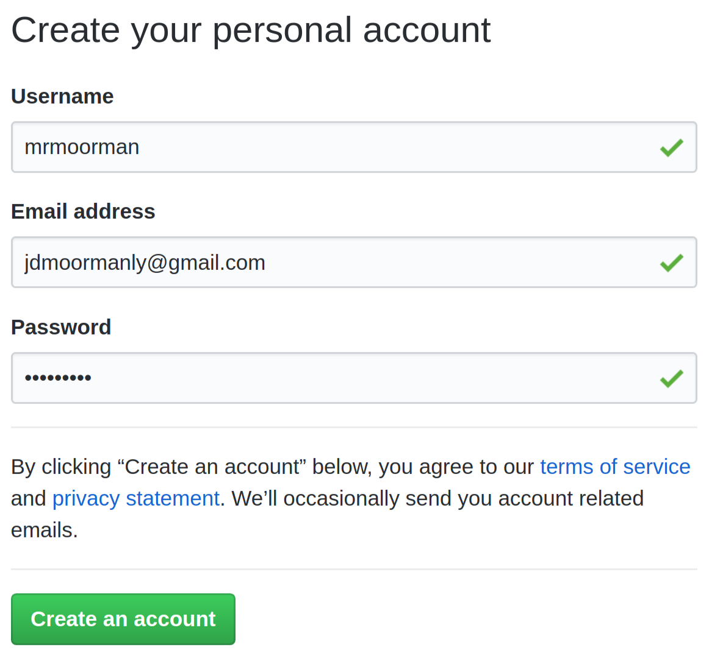


-vertical-

Verify your email address

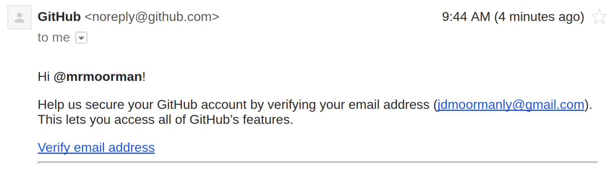


-vertical-

Options for creating a new project:

* Create a new empty repository

* Import code from an existing repository

* Fork an existing repository


-vertical-

To create a new empty repository,

click the plus at the top right corner

and select "New repository"

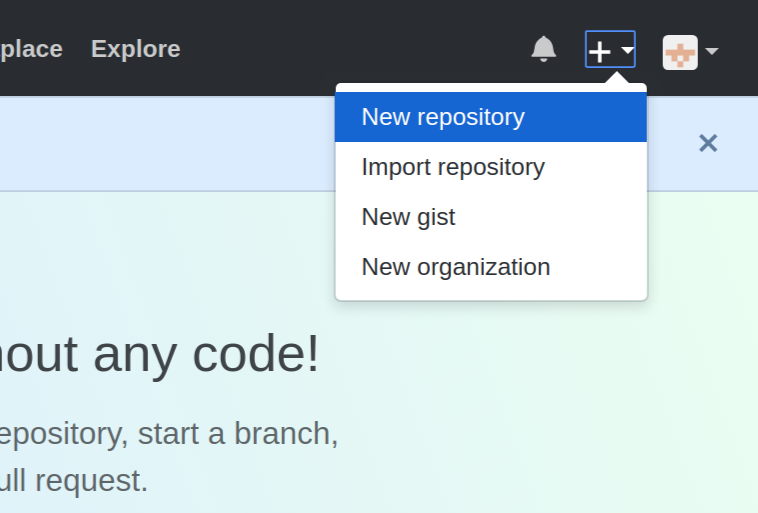


-vertical-

* Give your repository a name
* Tick "Initialize this repository with a README"
* Click "Create repository"


-vertical-

To import code from an existing repository,

click the plus at the top right corner

and select "Import repository"

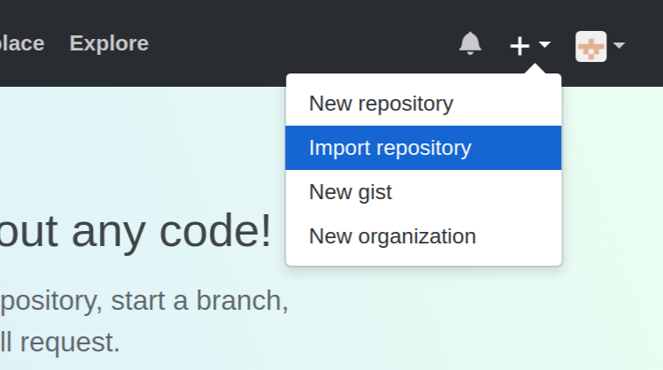


-vertical-

* Paste a link to the existing repository
* Give your new repository a name
* Click "Begin import"

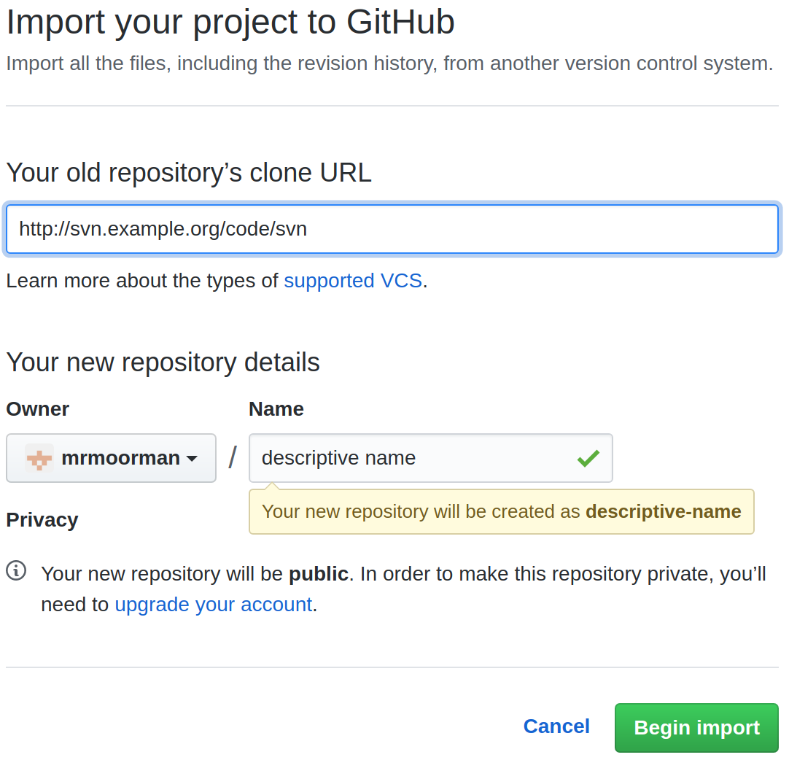


-vertical-

To fork an existing repository,

go to the repository you wish to fork

and click the fork button near the top right

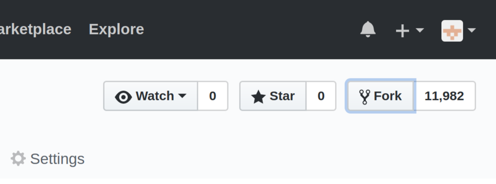


-vertical-

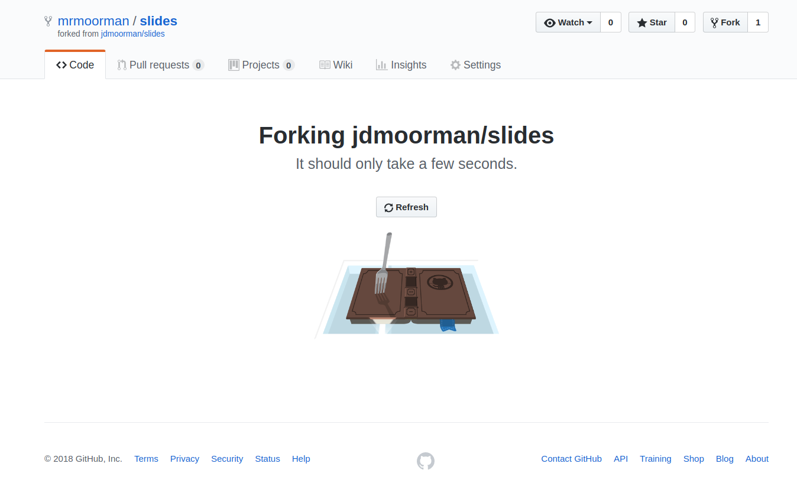


-vertical-

Forking is very similar to importing code from an existing repository, but only works on repositories within GitHub.


-vertical-

To rename a repository,

go to the settings tab

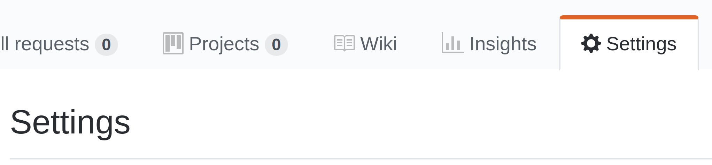


-vertical-

Type the new name of your repository

and click "Rename". 

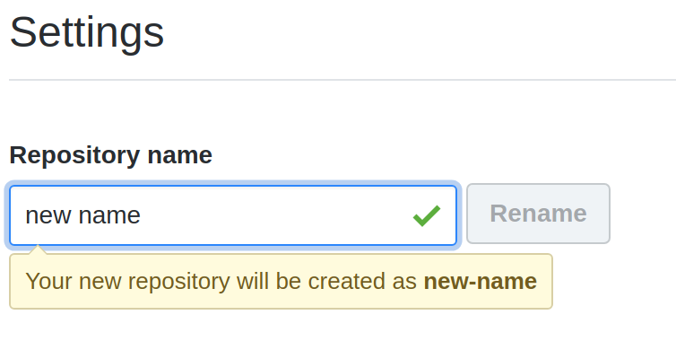


-vertical-

The page should reload and the name of your repository should change

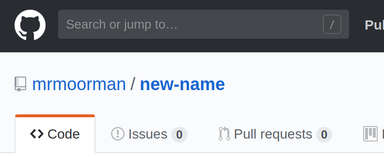


-vertical-

## Checkpoint

Go to the settings tab of your repository

Change the name of your repository to "test"


-vertical-

To host your GitHub project as a website,

go to the settings tab of your repository


-vertical-

* Scroll down until you see "GitHub Pages"
* Select "master branch"
* Click "Save"

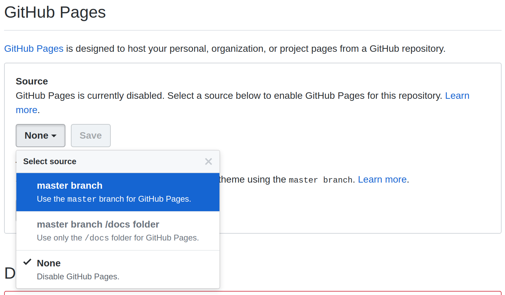


-vertical-

Check that a confirmation message appears

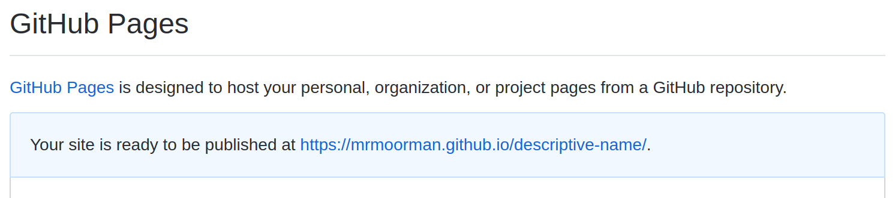


-vertical-

Eventually the confirmation message turns green if you wait a while and refresh the page

(takes about 30 secs, tops)

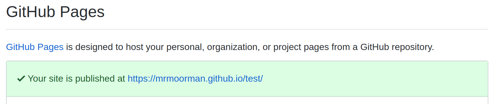


-vertical-

## Checkpoint

* Go to the settings tab of your repository

* Enable GitHub Pages on "master branch"

* visit the site at [username.github.io/test/]()

---

You will see outdated content if you visit before the confirmation turns green


-vertical-

The home of a GitHub Pages site is

[username.github.io/repository-name/]()

Unless the repository name is "username.github.io"

which will be accessible at [username.github.io]()


-horizontal-

## Prose.io

An online GitHub file editor


-vertical-

Enable editing at [prose.io](https://prose.io)


-vertical-

Authorize prose to access your repositories

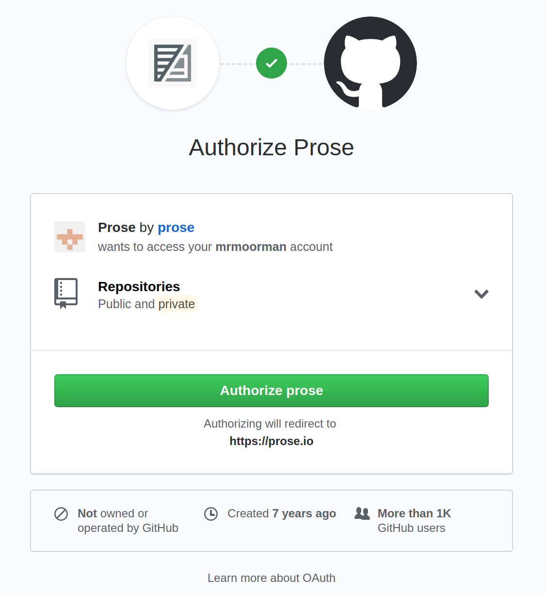


-vertical-

Open the "test" repository on prose.io


-vertical-

Create a new file

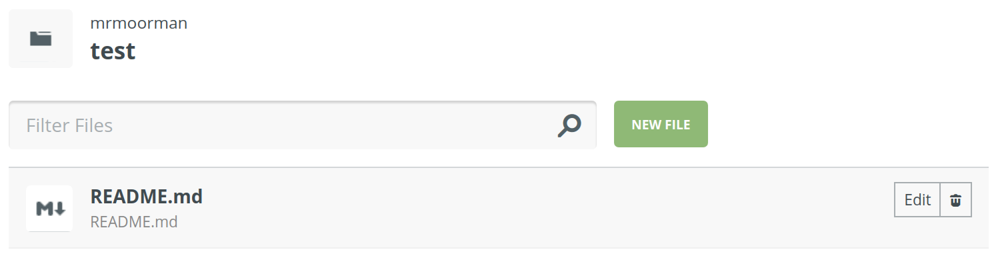


-vertical-

Name the file "index.md"

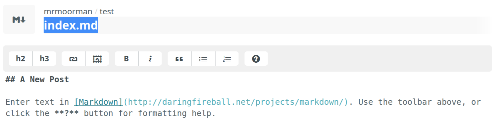


-vertical-

You can preview the file

by clicking the eyeball on the right

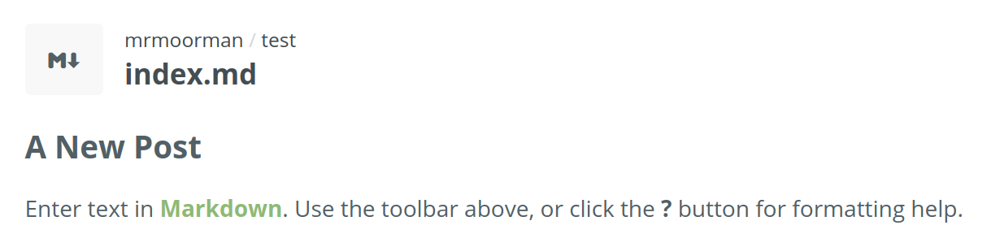

Switch back to editing by clicking

the pencil above the eyeball on the right


-vertical-

Save the file

* Click the save icon on the right
* Click "commit"

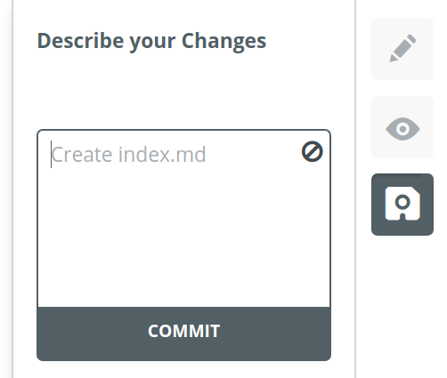


-vertical-

## Checkpoint

Verify that when you load [username.github.io/test]()

you see the contents of the file you just added


-vertical-

Today, everything will be written in Markdown

To view a summary of Markdown formatting, google "Markdown Cheatsheet" and click the first link

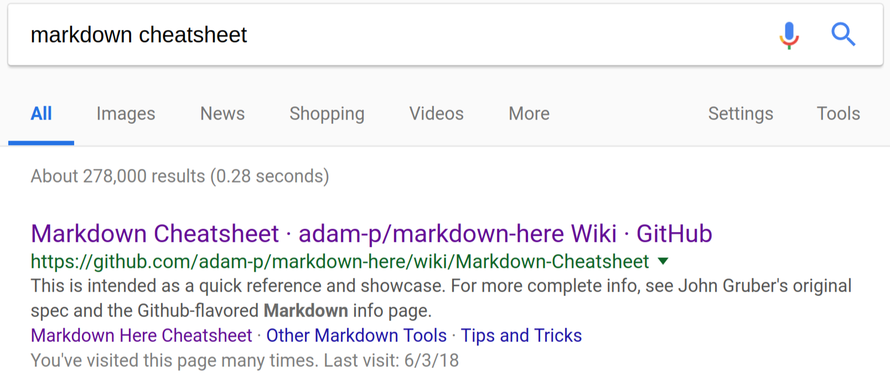


-horizontal-

## Reveal.js

Examples/Demonstrations

* [Reveal.js overview slides](https://revealjs.com/)

* [My 285J presentation](https://jacob.moorman.me/slides/s18math285j/)

* [This very presentation](https://jacob.moorman.me/slides/s18math290j/)


-vertical-

## Reveal.js

* beautiful html presentations

* slides exist in a 2d grid

* slides are ordered top-to-bottom, left-to-right


-vertical-

Fork [github.com/jdmoorman/slides]()

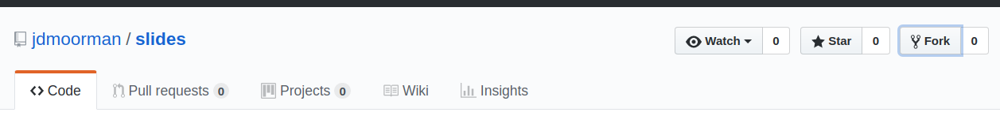


-vertical-

When finished, open the settings tab


-vertical-

Scroll down until you see the "GitHub Pages" section

Change the GitHub Pages branch to "master branch"

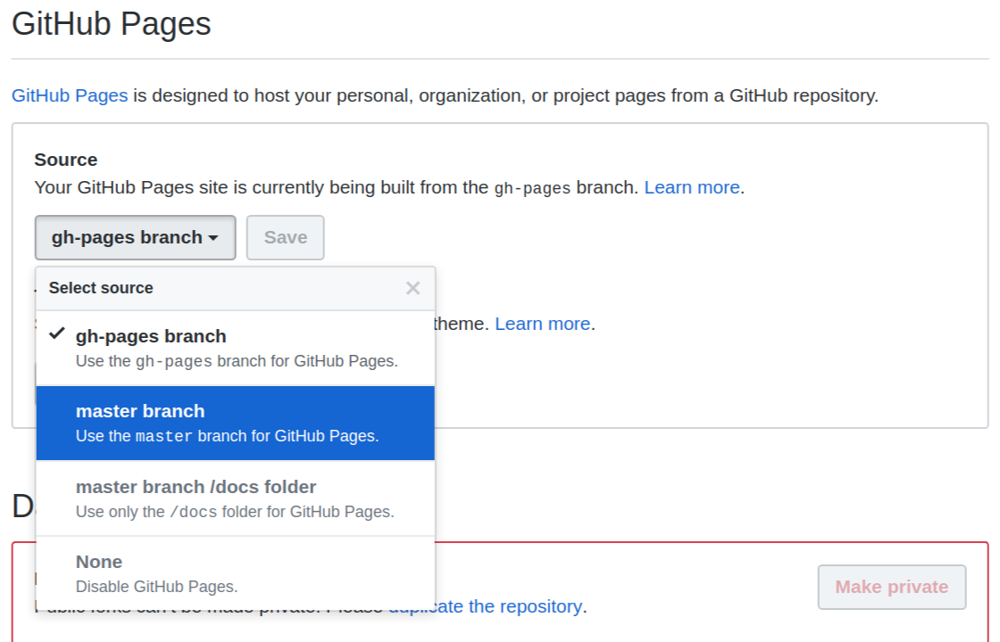


-vertical-

## Checkpoint

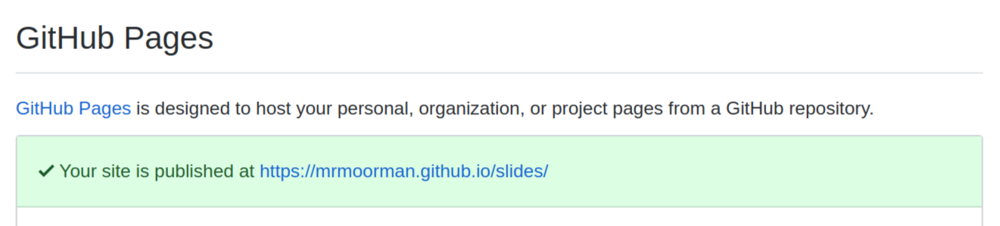

You should be able to load

[username.github.io/slides/template/]()


-vertical-

Remember

* Press 'o' for overview mode

* Use space bar to step through slides in order

* Use arrow keys to navigate presentation

* Organization is top to bottom, left to right


-vertical-

On prose.io, open the "slides" repository


-vertical-

Open the "template" folder

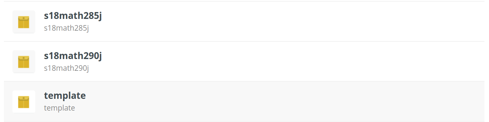


-vertical-

To edit your presentation

edit the code in "content.md"

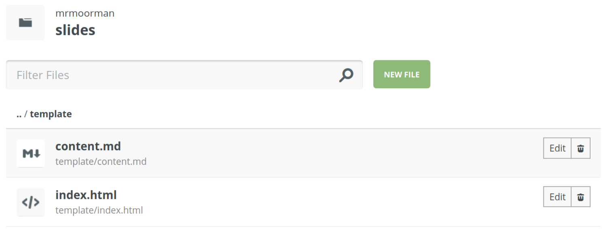


-vertical-

To add inline equations such as \\( c = \sqrt{a^2+b^2} \\), surround with `\\(  \\)`

```
\\( c = \sqrt{a^2+b^2} \\)
```

To add block equations such as \\[ c = \sqrt{a^2+b^2}, \\] surround with `\\[  \\]`

```
\\[ c = \sqrt{a^2+b^2} \\]
```


-vertical-

## Checkpoint

Try adding this equation to your presentation:
```
\\[ c = \sqrt{a^2+b^2} \\]
```
and verify that it renders correctly.

[username.github.io/slides/template/]()


-vertical-

To add a new slide in the current column, use

```markdown
-vertical-
```

To add a new slide and start a new column, use

```markdown
-horizontal-
```

These can be configured, but that's out of scope


-vertical-

Use Markdown to control the

appearance of your content


-horizontal-

## Jekyll

A website generator

Commonly used for blogs


-vertical-

For example: [jekyllrb.com]()

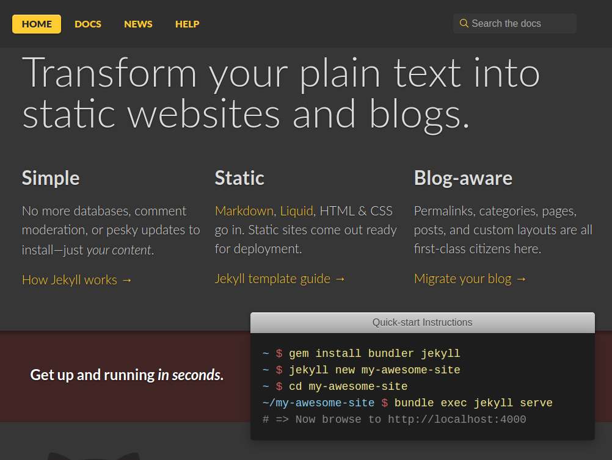


-vertical-

For example: [jacob.moorman.me](https://jacob.moorman.me)


-vertical-

Was generated from

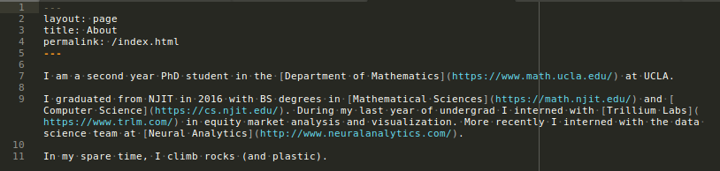

barely any more code than just the text on the screen


-vertical-

For this tutorial, I've chosen the template "Hyde". However, most templates function similarly.


-vertical-

### Other Forkable Jekyll Templates

- [Lanyon](https://github.com/poole/lanyon) by MDO
- [mojombo.github.io](https://github.com/mojombo/mojombo.github.io) by Tom Preston-Werner
- [Left](https://github.com/holman/left) by Zach Holman
- [Minimal Mistakes](https://github.com/mmistakes/minimal-mistakes) by Michael Rose
- [Skinny Bones](https://github.com/mmistakes/skinny-bones-jekyll) by Michael Rose
- [Jekyll Now](https://github.com/barryclark/jekyll-now) by Barry Clark

---

List taken from [Barry Clark's Jekyll Now repo](https://github.com/barryclark/jekyll-now)


-vertical-

Most templates will not have equation rendering

built in, but I've added it to this one


-vertical-

Fork [github.com/jdmoorman/hyde](https://github.com/jdmoorman/hyde)

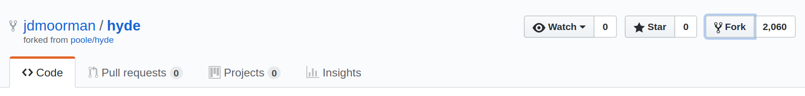


-vertical-

Open the settings tab, change the name

to [username.github.io](), and click rename

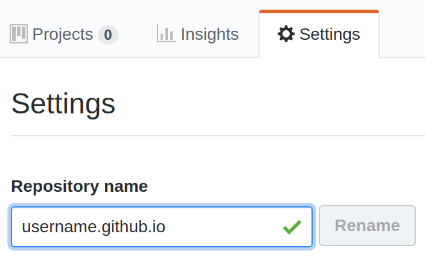


-vertical-

It's important that the name of the repository exactly matches [username.github.io]()


-vertical-

Scroll down until you see the "GitHub Pages" section

Change the GitHub Pages branch to "master branch"


-vertical-

Open a tab of prose.io and
open the [username.github.io]() repository

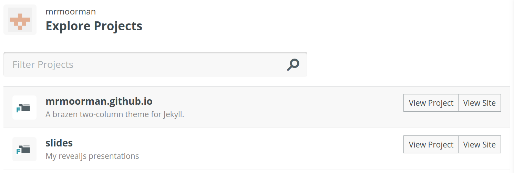


-vertical-

open "\_config.yml"

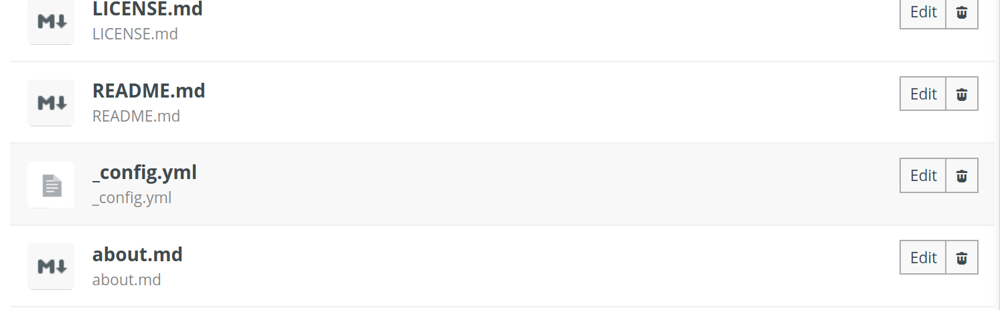


-vertical-

On line 13, change

```markdown
baseurl:         "/hyde"
```

to

```markdown
baseurl:         ""
```

and save the file


-vertical-

## Checkpoint

You should be able to load [username.github.io](https://mrmoorman.github.io/)

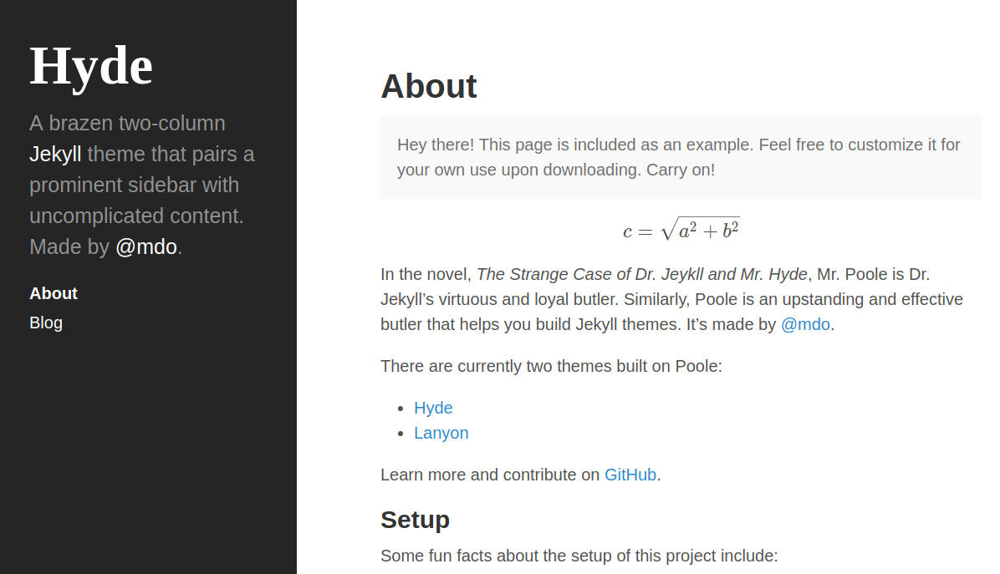


-vertical-

Back in "\_config.yml", change

```markdown
title:            Hyde
description:      'A brazen two-column ...'
url:              https://jacob.moorman.me/hyde/
```

to

```markdown
title:            Your Name
description:      'A brief description of yourself'
url:              https://username.github.io/
```

and save the file


-vertical-

also change

```markdown
author:
  name:           'Jacob Moorman'
  url:            https://jacob.moorman.me/
```

to

```markdown
author:
  name:           'Your Name'
  url:            https://username.github.io
```

and save the file


-vertical-

If you don't need a blog, you can change

```markdown
has_blog:         True
```

to

```markdown
has_blog:         False
```

but for now, just leave it as True


-vertical-

If you want to change the colorscheme, you can change

```markdown
theme_id: "7"
```

to any of \{7, 8, 9, a, b, c, d, e, f\}


-vertical-

## Checkpoint

Verify that the changes are reflected at

[username.github.io](https://mrmoorman.github.io/)


-horizontal-

## Adding pages
## to your website


-vertical-

Suppose you want to add pages for

each of the courses you teach.


-vertical-

in prose.io, go to the [username.github.io](https://mrmoorman.github.io/) repo


-vertical-

Add a new file

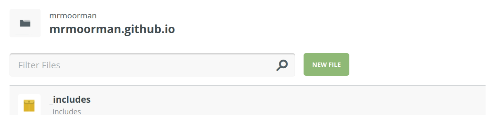


-vertical-

name the file "teaching.md"

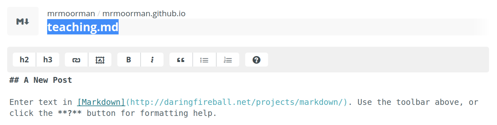


-vertical-

Replace the contents of "teaching.md" with

```markdown
---
layout: page
title: Teaching
---

The courses I'm teaching are:
* [Course 1](/teaching/course1/)
* [Course 2](/teaching/course2/)
```


-vertical-

Save "teaching.md", and return to prose.io at [username.github.io]()


Add another new file


-vertical-

Name the file "teaching/course1.md"

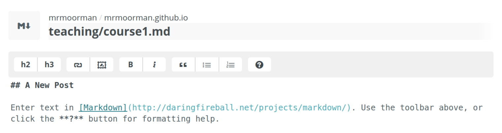

This will create a directory called "teaching" and a file in that directory called "course1.md"


-vertical-

Replace the contents of "course1.md" with

```markdown
---
layout: default
---
## Hello from course 1
```


-vertical-

Create another file called "teaching/course2.md"

replace its contents with 

```markdown
---
layout: default
---
## Hello from course 2
```


-vertical-

## Checkpoint

You should now be able to load

* [username.github.io/teaching/]()
* [username.github.io/teaching/course1/]()
* [username.github.io/teaching/course2/]()

And the links on the teaching page should work


-vertical-

To add a blog post, open prose.io to [username.github.io]()

navigate to the "\_posts" directory

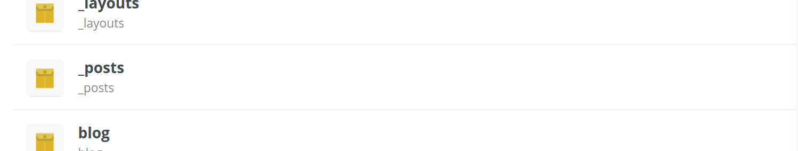


-vertical-

Create a new file, give it whatever title you want

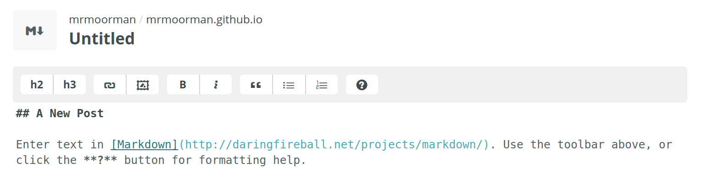

commit the file


-vertical-

Open the settings of the file,

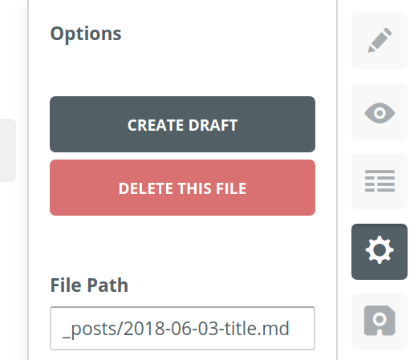

Click "create draft"


-vertical-

Click "Draft to post" and commit

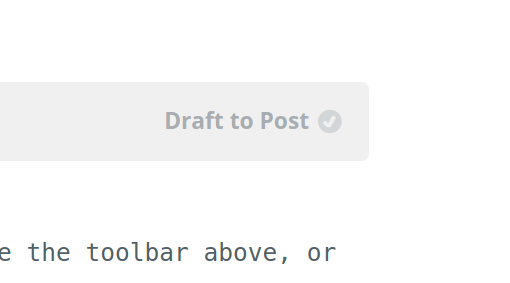

If you get a red warning, reload the page, hope the warning goes away


-vertical-

Click "Unpublished" and commit

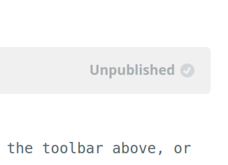


-vertical-

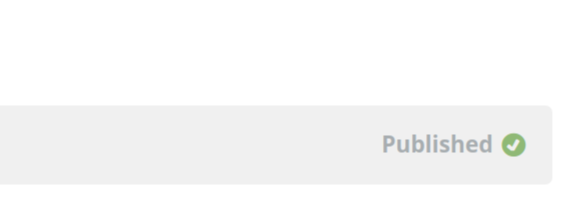


-vertical-

## Checkpoint

Your new blog post should show up at

[username.github.io/blog/]()


-horizontal-

## Adding images

prose.io allows you to add images easily

find an image to add to your "About" page


-vertical-

Open [username.github.io/]() > about.md in prose.io 

click the image icon

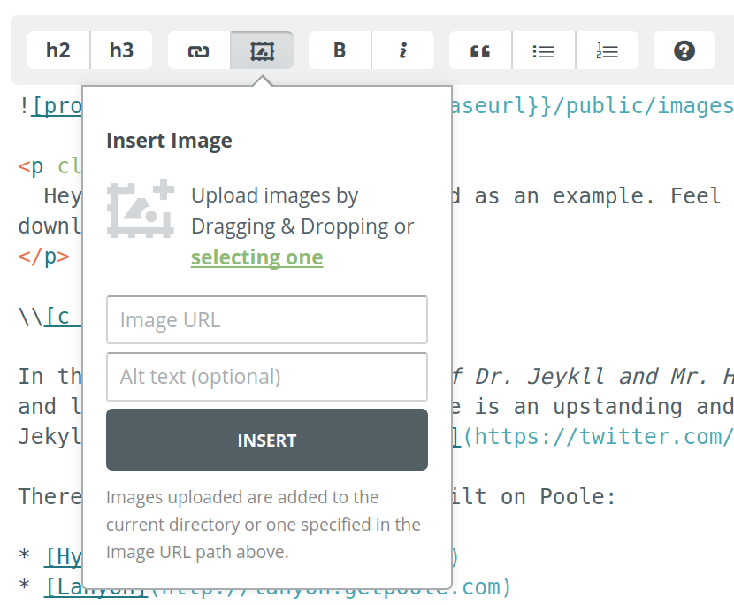


-vertical-

Drag and drop your image, but do not click "insert"

First you must specify where the image should go


-vertical-

For your website repository, a good location is:

```
/public/images/filename.jpg
```

For your slides repository, the location should be

```
/template/images/filename.jpg
```


-vertical-

Edit the location of the image, and click "insert"

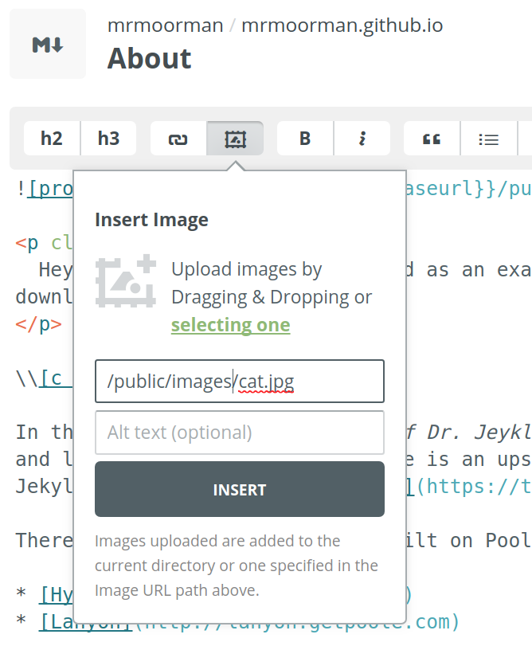


-vertical-

A Markdown image link will be inserted into the text.

```markdown

```

If you want to resize the image you can add 

```markdown
{:height="36px" width="36px"}
```

or

```markdown
{:height="50%" width="50%"}
```

to the end of the line


-vertical-

## Checkpoint

Your image should show up at [username.github.io/]()


-horizontal-

## Things not covered that
## you may find useful

* Using Git for version control
* [How to install Node.js and npm](https://www.npmjs.com/get-npm)
* [How to host reveal.js locally](https://github.com/hakimel/reveal.js#installation)
* [How to host Jekyll locally](https://jekyllrb.com/docs/installation/)
* [How Jekyll works](https://jekyllrb.com/docs/home/)
* [Markdown Cheatsheet](https://github.com/adam-p/markdown-here/wiki/Markdown-Cheatsheet)


-horizontal-

## Good Luck, Have Fun

If you need help, feel free to reach out

[jdmoorman@math.ucla.edu]()

These slides are available at

[jacob.moorman.me/slides/s18math290j](https://jacob.moorman.me/slides/s18math290j)