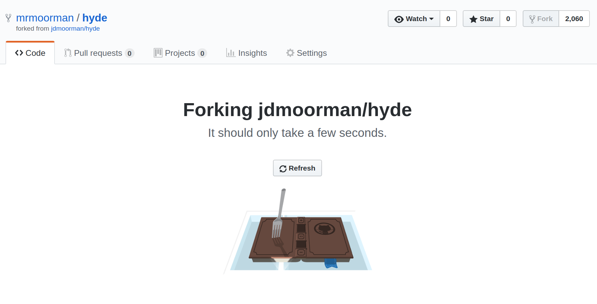

* Press 'o' for overview mode

* Use arrow keys to navigate presentation

* Organization is top to bottom, left to right


-vertical-

Open a web browser if you want to follow along

Chrome, Firefox, Internet Explorer, etc


-vertical-

* **GitHub**: hosting, version control

* **Reveal.js**: presentations

* **Jekyll**: websites

[jacob.moorman.me/slides/s18math290j/](https://jacob.moorman.me/slides/s18math290j/)


-horizontal-

## Github

Create an account at [github.com/join](https://github.com/join)


-vertical-

Verify your email address


-vertical-

Options for creating a new project:

* Create a new empty repository

* Import code from an existing repository

* **Fork an existing repository**


-vertical-

Create a new empty repository


-vertical-

* Give your repository a name
* Tick "Initialize this repository with a README"
* Click "Create repository"


-vertical-

Import code from an existing repository


-vertical-

* Paste a link to the existing repository
* Give your new repository a name
* Click "Begin import"


-vertical-

Fork an existing repository


-vertical-

Enable GitHub Pages web publishing 


-vertical-

* Select "master branch"
* Click "Save"


-vertical-

* Check that a confirmation message appears


-horizontal-

## Reveal.js

Examples/Demonstrations

* [Reveal.js overview slides](https://revealjs.com/)

* [My 285J presentation](https://jacob.moorman.me/slides/s18math285j/)

* [This very presentation](https://jacob.moorman.me/slides/s18math290j/)


-vertical-

## Reveal.js

* beautiful html presentations

* slides exist in a 2d grid

* slides are ordered top-to-bottom, left-to-right


-vertical-

Fork [github.com/jdmoorman/slides](https://github.com/jdmoorman/slides)


-vertical-


-vertical-

When finished, open the settings tab


-vertical-

Scroll down until you see the "GitHub Pages" section

Change the GitHub Pages branch to "master branch"


-vertical-

## Checkpoint


You should be able to load

[[username].github.io/slides/template/](https://mrmoorman.github.io/slides/template)


-vertical-

## Next steps

* Editing files online
* Adding content


-vertical-

Enable editing at [prose.io](https://prose.io)


-vertical-

Authorize prose to access your repositories


-vertical-

Open the "slides" repository


-vertical-

Open the "template" folder


-vertical-

To edit your presentation

edit the code in "content.md"


-vertical-

To add inline equations such as \\( c = \sqrt{a^2+b^2} \\), surround with `\\(  \\)`

```
\\( c = \sqrt{a^2+b^2} \\)
```

To add block equations such as \\[ c = \sqrt{a^2+b^2}, \\] surround with `\\[  \\]`

```
\\[ c = \sqrt{a^2+b^2} \\]
```


-vertical-

Try adding this equation to your presentation:
```
\\[ c = \sqrt{a^2+b^2} \\]
```
and verify that it renders correctly.

[[username].github.io/slides/template/](https://mrmoorman.github.io/slides/template)


-vertical-

To add a new slide in the current column, use

```markdown
-vertical-
```

To add a new slide and start a new column, use

```markdown
-horizontal-
```


-vertical-

To view a summary of Markdown formatting, google "Markdown Cheatsheet" and click the first link


-horizontal-

## Jekyll

A website generator

Commonly used for blogs


-vertical-

For example: [jacob.moorman.me](https://jacob.moorman.me)


-vertical-

Was generated from


barely any more code than just the text on the screen


-vertical-

For this tutorial, I've chosen the template "Hyde". However, most templates function similarly.


-vertical-

Fork [github.com/jdmoorman/hyde](https://github.com/jdmoorman/hyde)


-vertical-




-vertical-

Open the settings tab, change the name

to [username].github.io, and click rename


-vertical-

Scroll down until you see the "GitHub Pages" section

Change the GitHub Pages branch to "master branch"


-vertical-

Open a tab of prose.io and
open the username.github.io repository


-vertical-

open "\_config.yml"


-vertical-

On line 14, change

```markdown
baseurl:         /hyde
```

to

```markdown
baseurl:         /
```

and save the file


-vertical-

## Checkpoint

You should be able to load [[username].github.io](https://mrmoorman.github.io/)


-vertical-

Back in "\_config.yml", change

```markdown
title:            Hyde
description:      'A brazen two-column ...'
url:              https://jacob.moorman.me/hyde/
```

to

```markdown
title:            Your Name
description:      'A brief description of yourself'
url:              https://username.github.io/
```

and save the file


-vertical-

also change

```markdown
author:
  name:           'Jacob Moorman'
  url:            https://jacob.moorman.me/
```

to

```markdown
author:
  name:           'Your Name'
  url:            https://username.github.io
```

and save the file


